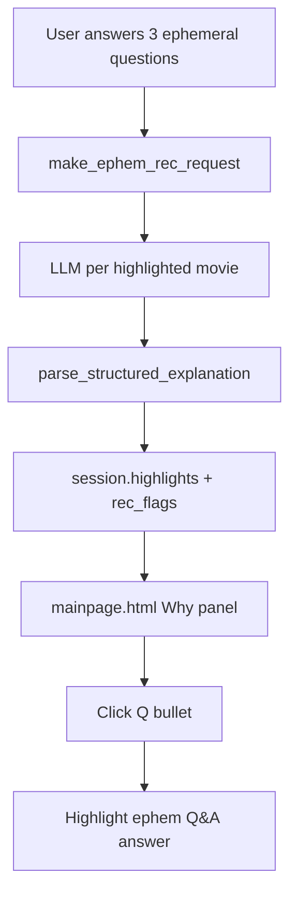

# Implementation Summary (for review)

This document maps the proposal to concrete code changes in Rebert p7.1.

## Condition switch (baseline vs modified)

Environment variable read in `rebert/_prototype_7_1_/web/config.py`:

| Value | Behavior |
|-------|----------|
| `baseline` | Original p7.1 UI — rationale in tooltip/chat only |
| `modified` | Structured explanations + “Why this title” panel (default) |
| `modified_full` | Modified + Level 3 review excerpt IDs in LLM prompt |

Run scripts: `projects/grounded-explanations/scripts/run_baseline.sh` (port 5000), `run_modified.sh` (port 5001).

## Level 1 — Prompt pipeline

| File | Change |
|------|--------|
| `web/prompts.py` | `EPHEM_RECOMMENDATION_EXPLANATION_EXTENSION`, optional excerpt extension |
| `web/llm.py` | `build_ephem_recommendation_user_question()`, numbered Q&A, parse explanation |
| `web/explanations.py` | Parse `<USER_ALIGNMENT>`, `<REVIEW_BASIS>`, `<CONFIDENCE>`; format tooltips |

LLM response schema (modified mode):

```text
<MATCH>...</MATCH>
<RATIONALE>...</RATIONALE>
<USER_ALIGNMENT>
Q1: ...
Q2: ...
</USER_ALIGNMENT>
<REVIEW_BASIS>
...
</REVIEW_BASIS>
<CONFIDENCE>high — ...</CONFIDENCE>
```

Guardrails in prompt: use “uncertain — limited review evidence available” when reviews are weak; do not invent critic quotes.

## Level 2 — Interface

| File | Change |
|------|--------|
| `web/templates/mainpage.html` | Study banner, “Why this title” panel, hidden Q&A fields |
| `web/static/rebert_mainpage_ui.js` | `highlightEphemAnswer()` — bullet click scrolls to linked answer |
| `web/serve_ephem_rec.py` | Pass explanation into `rec_flags`; chat intro points to panel |
| `web/utilities.py` | `apply_explanation_ui_state()` |

## Level 3 — Review excerpts (optional)

| File | Change |
|------|--------|
| `web/explanations.py` | `create_review_excerpt_str()` — trim text, assign `R1`, `R2`, `R3` |
| `web/llm.py` | Uses excerpts when `REBERT_REVIEW_EXCERPT_IDS` is true |

## Data flow



## Automated verification

```bash
PYTHONPATH=. python scripts/verify_project.py
```

See [`VERIFICATION.md`](VERIFICATION.md) for latest run output.
